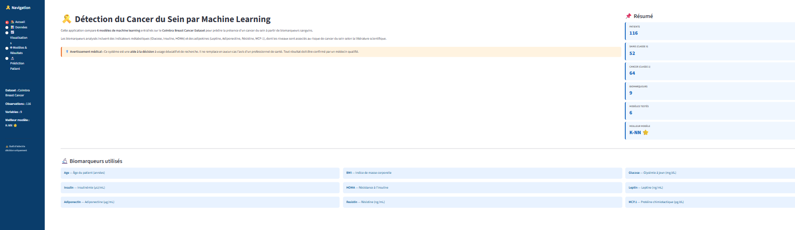
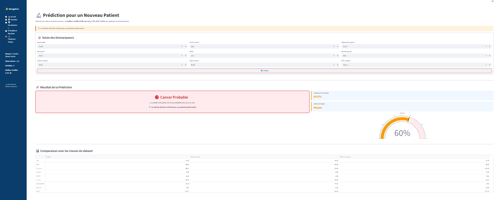
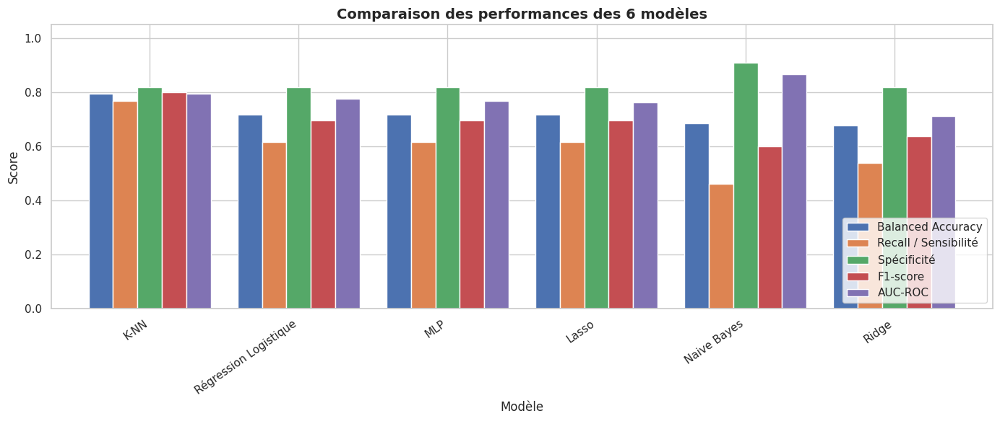
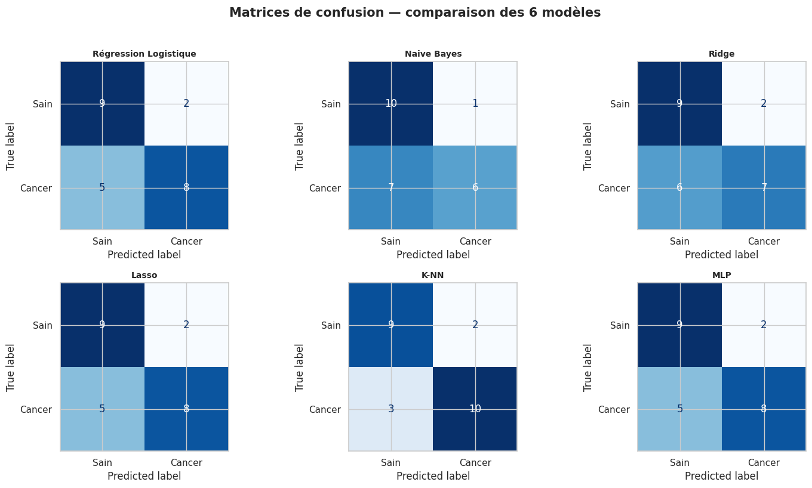
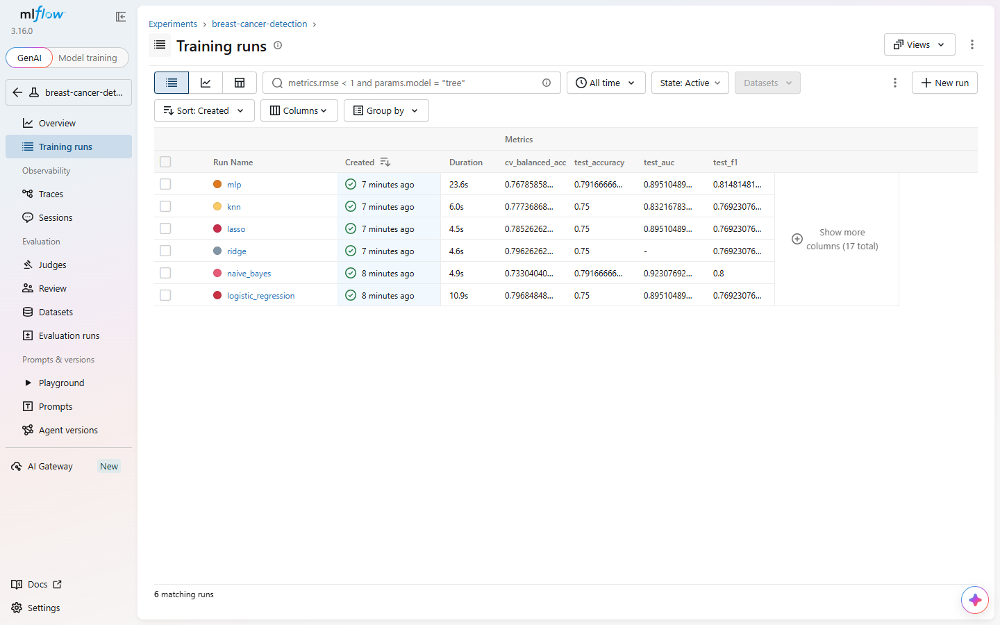

# Breast Cancer Prediction using Machine Learning

## Project Date

**May 2026**

## Overview

This project focuses on the development of a Machine Learning-based decision support system for breast cancer prediction using biomedical variables. The objective is not to replace medical diagnosis, but to evaluate how supervised learning models can help distinguish between healthy patients and patients diagnosed with breast cancer based on clinical and blood biomarker data.

The project includes a complete Machine Learning workflow: exploratory data analysis, preprocessing, model training, hyperparameter tuning, evaluation with medical metrics, and deployment through a Streamlit web application.

## Project Context

Breast cancer early detection is a major healthcare challenge. Traditional screening methods such as mammography, ultrasound, and MRI are widely used, but they may present limitations depending on access, cost, and clinical context.

This project investigates the following question:

> Can Machine Learning techniques effectively detect breast cancer using blood biomarkers and clinical data?

## Dataset

The dataset used in this project contains biomedical information related to breast cancer detection.

* Number of observations: **116**
* Number of explanatory variables: **9**
* Target variable: **Classification**
* Classes:

  * `0`: Healthy
  * `1`: Breast cancer

Main variables used:

* Age
* BMI
* Glucose
* Insulin
* HOMA
* Leptin
* Adiponectin
* Resistin
* MCP.1

## Methodology

The project follows a complete supervised Machine Learning pipeline:

1. Data loading and target recoding
2. Exploratory Data Analysis
3. Correlation analysis and biomarker distribution study
4. Train/test split with stratification
5. Feature standardization
6. Model training using pipelines
7. Hyperparameter tuning with GridSearchCV
8. Model evaluation using medical metrics
9. Selection of the best-performing model
10. Deployment with Streamlit

## Models Compared

Six supervised classification models were trained and compared:

| Model               | Purpose                               |
| ------------------- | ------------------------------------- |
| Logistic Regression | Interpretable baseline model          |
| Naive Bayes         | Probabilistic classification          |
| Ridge Classifier    | Handling collinearity                 |
| Lasso               | Feature selection                     |
| K-Nearest Neighbors | Local similarity-based classification |
| MLP Classifier      | Neural network approach               |

A DummyClassifier was also used as a naive baseline to verify that the trained models perform better than a simple majority-class strategy.

## Evaluation Metrics

Since this is a medical classification problem, accuracy alone is not sufficient. The evaluation focuses on metrics that are more relevant in healthcare contexts:

* Accuracy
* Balanced Accuracy
* Recall / Sensitivity
* Specificity
* Precision
* F1-score
* AUC-ROC
* False Negatives
* False Positives
* Matthews Correlation Coefficient

## Results

The best-performing model on the test set was **K-Nearest Neighbors (KNN)**.

| Metric               |  Value |
| -------------------- | -----: |
| Accuracy             | 79.17% |
| Recall / Sensitivity | 76.92% |
| Specificity          | 81.82% |
| F1-score             | 80.00% |

The model selection was based on the best compromise between detecting cancer cases and limiting false alerts.

## Streamlit Application

A Streamlit application was developed to make the model accessible through a simple user interface. The user can enter patient biomarker values and obtain a prediction result.

Main features:

* Manual input of patient biomedical variables
* Automatic preprocessing using the trained scaler
* Prediction using the saved Machine Learning model
* Display of the predicted class
* Simple and interactive interface

## Screenshots

### Streamlit Prediction Interface



### Prediction Result



### Model Comparison



### Confusion Matrix or ROC Curve



## Project Structure

```text
breast-cancer-ml-prediction/
│
├── README.md
├── requirements.txt
├── .gitignore
├── .dockerignore
├── Dockerfile
│
├── .github/
│   └── workflows/
│       └── ci-cd.yml          # Lint + tests + build Docker (GitHub Actions)
│
├── app/
│   └── app.py                 # App Streamlit (+ page Monitoring)
│
├── train/
│   └── train_model.py         # Entraînement + tracking MLflow 
│
├── monitoring/
│   ├── logger.py              # Journalisation des prédictions en production
│   ├── drift_report.py        # Rapport de data drift (Evidently)
│   ├── reference_data.csv     # Données de référence (générées à l'entraînement)
│   └── predictions_log.csv    # Log des prédictions (généré en production)
│
├── tests/
│   └── test_model.py          # Tests pytest exécutés par la CI
│
├── data/
│   └── dataR2.csv
│
├── models/
│   └── pipeline.pkl            # scaler + modèle réunis en un seul objet
│
├── restore_run.py              # Revenir à un run MLflow antérieur en une commande
│
├── notebooks/
│   └── breast_cancer_modeling.ipynb
│
├── reports/
│   ├── breast_cancer_report.pdf
│   └── breast_cancer_presentation.pdf
│
└── images/
    ├── streamlit_app.png
    ├── prediction_result.png
    ├── model_comparison.png
    └── model_evaluation.png
```

## How to Run the Project

### 1. Clone the repository

```bash
git clone https://github.com/arefbakali/breast-cancer-ml-prediction.git
cd breast-cancer-ml-prediction
```

### 2. Create a virtual environment

```bash
python -m venv .venv
```

### 3. Activate the environment

On Windows:

```bash
.venv\Scripts\activate
```

On macOS/Linux:

```bash
source .venv/bin/activate
```

### 4. Install dependencies

```bash
pip install -r requirements.txt
```

### 5. Run the Streamlit application

```bash
streamlit run app/app.py
```

## MLOps: Experiment Tracking, CI/CD & Monitoring

Beyond the notebook-based experimentation, this project also includes a
minimal but complete MLOps layer, so the model can be retrained, deployed
and monitored like a production service.

### 1. Experiment tracking (MLflow)

`train/train_model.py` retrains the six models and logs each run to
MLflow: hyperparameters, test metrics (accuracy, precision, recall, F1,
AUC, false negatives/positives), a confusion matrix image, an ROC curve
image, and the fitted pipeline itself (with an inferred input/output
signature).

```bash
python train/train_model.py

# Compare all runs side by side (params, metrics, confusion matrix, ROC):
mlflow ui --backend-store-uri ./mlruns
# then open http://localhost:5000
```



This project intentionally does **not** use the MLflow Model Registry: the
app reads `models/pipeline.pkl` directly from disk, and a single-person
project has no real use for version staging (Staging/Production) across a
team. The tracking above is what matters here — it lets any past run be
recovered and compared, e.g. to restore the model from a specific run:

```bash
python restore_run.py <run_id>
```

The script fetches the pipeline logged under that run and overwrites
`models/pipeline.pkl` with it — a one-line rollback to any past run, no
manual file surgery needed.

The training script also re-saves `models/pipeline.pkl` for the best model
(K-NN), so the Streamlit app keeps working without needing an MLflow
server at inference time, and exports `monitoring/reference_data.csv`,
used as the baseline for drift detection.

**Why a single `pipeline.pkl` instead of separate `model.pkl` / `scaler.pkl`?**
The scaler and the model must always be used together, in the same order
they were fitted. Saving them as one scikit-learn `Pipeline` object removes
any chance of loading a mismatched pair (e.g. an old scaler with a newer
model) — the app calls `pipeline.predict(...)` directly, with no manual
scaling step to forget.

### 2. Containerization (Docker)

```bash
docker build -t breast-cancer-ml-prediction .
docker run -p 8501:8501 breast-cancer-ml-prediction
```

The app is then available at `http://localhost:8501`.

### 3. CI/CD (GitHub Actions)

`.github/workflows/ci-cd.yml` runs automatically on every push / pull
request to `main`:

1. **Lint** — `flake8` static analysis.
2. **Test** — `pytest tests/` (model loading, prediction sanity, accuracy
   above a minimum threshold, prediction logger).
3. **Build** — builds the Docker image to catch packaging issues early.

Pushing the image to a registry and auto-deploying is left as a
configurable extra step (commented in the workflow), since it requires
registry credentials specific to each deployment target.

### 4. Model monitoring & data drift (Evidently)

Every prediction made from the **🔬 Prédiction Patient** page in the app is
logged to `monitoring/predictions_log.csv` (features, prediction,
probability, timestamp) via `monitoring/logger.py`.

The new **🩺 Monitoring** page in the app compares this production log
against the training data distribution (`monitoring/reference_data.csv`)
using [Evidently](https://www.evidentlyai.com/), and displays whether
significant data drift is detected — a signal that the model may need
retraining. The full HTML report can also be generated from the command
line:

```bash
python monitoring/drift_report.py
# → monitoring/reports/data_drift_report.html
```

## Requirements

Main libraries used:

* Python
* Pandas
* NumPy
* Scikit-learn
* Matplotlib
* Seaborn
* Streamlit
* OpenPyXL
* MLflow (experiment tracking & model registry)
* Evidently (data drift monitoring)
* Docker (containerization)
* GitHub Actions (CI/CD)
* pytest / flake8 (testing & linting)

## Key Takeaways

* Machine Learning can provide useful support for binary classification in a medical context.
* KNN achieved the best compromise on the test set.
* Medical evaluation requires more than accuracy; recall, specificity, F1-score, false negatives, and false positives are essential.
* The small dataset size remains a limitation, so the results should be interpreted carefully.

## Limitations

* The dataset contains only 116 observations.
* The model is intended for academic and educational purposes only.
* The application should not be used as a real medical diagnostic tool.
* Additional clinical validation would be required before any real-world use.

## Future Improvements

* Test the approach on a larger medical dataset
* Add model explainability with SHAP or LIME
* Improve the Streamlit interface
* Deploy the application online (e.g. Streamlit Community Cloud, or the
  Docker image on a cloud container service)
* Trigger automated retraining when Evidently detects significant drift,
  instead of only surfacing an alert
* ~~Add a probability score instead of only a class prediction~~ ✅ done

## Author

**Aref Bak Ali**<br>
AI, Data Science & Agentic AI Student<br>
GitHub: https://github.com/arefbakali<br>
LinkedIn: https://linkedin.com/in/aref-bak-ali/
